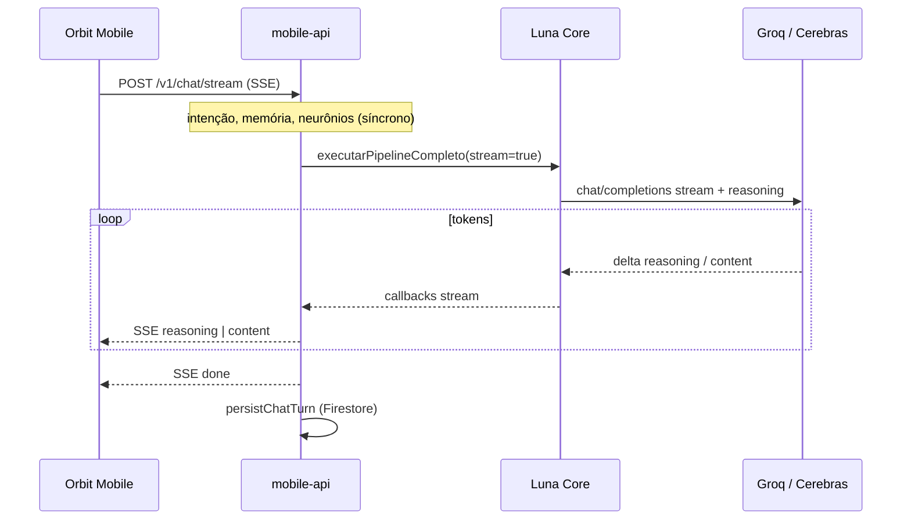
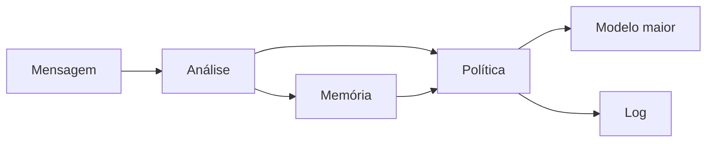

# Luna Core

> **A LLM grande é a voz. Os modelos menores são os neurônios. O Core orquestra.**

Monorepo TypeScript do ecossistema **Luna / Orbit** — identidade artificial persistente (PAIA), API mobile em produção e app **Orbit Mobile** (Expo).

**Repositório único:** [github.com/NowardEthan/luna-core](https://github.com/NowardEthan/luna-core)  
**Versão Core:** `0.2.0` · **Node** ≥ 20 · **Deploy API:** Railway (Docker)

---

## O que vive neste repo

| Pasta | O quê | Deploy |
|-------|--------|--------|
| [`src/`](src/) | **Luna Core** — pipeline, memória, presença, agente IDE, providers LLM | Compilado em `dist/`; consumido pela API e pelo desktop |
| [`mobile-api/`](mobile-api/) | **Luna Mobile API** — HTTP para o app mobile (chat, STT, visão, billing) | **Railway** (`Dockerfile`, porta 7742) |
| **Orbit Mobile** (repo à parte) | App React Native / Expo — pasta canónica `Projects/Luna/orbit-mobile/` | APK local / lojas |
| [`tests/`](tests/) | Vitest do Core | CI local |
| [`env.profiles/`](env.profiles/) | Exemplos `.env` (local, Groq, Railway) | — |

O **Orbit desktop** (Electron + Storybook) e o **Orbit Mobile** (Expo) vivem noutros repos / pastas do workspace local `Projects/Luna/` — **não neste Git**. A API **depende só deste repo**; o app mobile consome a Mobile API.

---

## Arquitectura end-to-end (mobile)



**Princípio:** só a **voz final** (`responderComoLuna`) faz stream. Análise, memória e política correm antes — o utilizador vê «A pensar…» até ao primeiro token.

---

## Visão geral do Core

| Conceito | Descrição |
|----------|-----------|
| **Hipótese** | Política calculada (constituição + neurônios menores) > prompt monolítico |
| **Modelo menor** | Análise, memória, planejamento, avaliação |
| **Modelo maior** | Resposta final ao utilizador |
| **Persistência** | Sessões JSON, memória longa SQLite, perfil, presença |
| **Clientes** | Orbit Mobile (este repo), Orbit desktop (externo), CLI |

### Estado das fases (Core)

| Fase | Entregável | Status |
|------|------------|--------|
| **V0** | Constituição, pipeline, política, validação empírica | ✅ |
| **V1** | Memória de sessão, neurônio de memória, SQLite + embeddings | ✅ |
| **V2** | Presença contextual, fila/daemon | ✅ |
| **V3.1–V3.2** | Prior preditivo, perfil comportamental | ✅ |
| **V3.3–V3.8** | Agente IDE (Forge) | 🔵 no código |
| **Mobile API + Orbit Mobile** | Chat cloud, Firebase, billing, streaming Cerebras | ✅ |
| **Lumen** | Didática professora (diretrizes + validador) | 🔵 `src/lumen/` |
| **V4+** | Plasticidade, corpo digital | ⬜ planejado |

**Testes Core:** `npm test` (Vitest) · `npm run empirico` (regressão empírica)

---

## Provedores LLM

| Provider | Papel | gzip | Reasoning | Stream SSE |
|----------|-------|------|-----------|------------|
| **Groq** | Chat rápido, STT (Whisper), visão, neurônios auxiliares | — | parcial (`gpt-oss`) | fallback JSON |
| **Cerebras** | Modo «Completa» — GLM 4.7 | sim (≥ 8 KB) | `parsed` + faixa live | **primário** (`/v1/chat/stream`) |
| **auto** | Escolhe conforme mensagem/plano | se Cerebras | se Cerebras | se Cerebras |

### Nomes Luna (UI)

| Interno | Nome | Papel |
|---------|------|--------|
| `auto` | **Luna Orbita** | Roteamento automático |
| `groq` | **Luna Pulse** | Respostas ágeis (GPT-OSS) |
| `cerebras` | **Luna Core** | Raciocínio profundo + streaming (GLM 4.7) |

Fonte: `mobile-api/src/modelBrands.ts`

Variáveis: ver [Railway](#deploy-railway) e [`.env.example`](.env.example).

---

## Luna Mobile API

Servidor HTTP Node (`mobile-api/src/server.ts`). Healthcheck: `GET /health`.

### Endpoints principais

| Método | Rota | Descrição |
|--------|------|-----------|
| `GET` | `/health` | `coreReady`, `llmConfigured`, **`streamSupported`**, providers |
| `POST` | `/v1/chat` | Chat JSON completo (Groq, fallback, clientes antigos) |
| `POST` | `/v1/chat/stream` | **SSE** — eventos `status`, `reasoning`, `content`, `done`, `error` |
| `POST` | `/v1/transcribe` | STT (Groq Whisper) |
| `POST` | `/v1/vision` | Descrição de imagens |
| `POST` | `/v1/extract-documents` | PDF, DOCX, MD, … |
| `POST` | `/v1/billing/*` | Checkout Asaas, sync plano, webhook |

Auth: `Authorization: Bearer <Firebase idToken>` quando `LUNA_FIREBASE_AUTH_REQUIRED=true`.

### Streaming Cerebras (servidor)

- `executarChatMobileStream` → pipeline com `stream: true`
- `completarStreamOpenAi` — parse SSE Cerebras, gzip condicional
- `raciocinioAtivo: true` para provider Cerebras
- Firestore: **`persistChatTurn` só no evento `done`** (sem mensagens parciais na cloud)

### Local

```bash
npm run build          # na raiz — gera dist/ do Core
cd mobile-api && npm install
npm run dev            # tsx watch, porta 7742
curl http://localhost:7742/health
```

---

## Orbit Mobile

App Expo na pasta canónica **`Projects/Luna/orbit-mobile/`** (repositório Git separado deste monorepo).

### Destaques

- **Streaming:** `lunaChatStream` + buffer por palavra (`StreamWordReveal`) + `ReasoningLiveStrip`
- **Fallback:** se `/health` não tiver `streamSupported` ou stream falhar antes do 1.º token → `POST /v1/chat`
- **Cloud:** Firebase Auth, Firestore (conversas, perfil), upload de media
- **Billing:** quotas por plano, checkout Asaas via API
- **Providers:** Groq / Cerebras / Auto (Ajustes)

### Configuração

```bash
cd ../orbit-mobile   # a partir de Projects/Luna/luna-core, ou Projects/Luna/orbit-mobile
npm install
cp .env.example .env
# EXPO_PUBLIC_LUNA_API_URL=https://seu-servico.up.railway.app
npm run android:run
```

---

## Deploy (Railway)

1. Ligar repo **NowardEthan/luna-core** ao serviço Railway (root = repo root).
2. `railway.toml` + `Dockerfile` — healthcheck `GET /health`, porta **7742**.
3. Variables → copiar de [`env.profiles/railway.env.example`](env.profiles/railway.env.example):

```env
# Groq (STT + auxiliar)
LUNA_API_KEY=gsk_...
LUNA_API_BASE=https://api.groq.com/openai/v1
LUNA_MODELO_MENOR=llama-3.1-8b-instant
LUNA_MODELO_MAIOR=openai/gpt-oss-120b

# Cerebras (Completa + stream)
CEREBRAS_API_KEY=csk_...
CEREBRAS_MODEL=zai-glm-4.7
CEREBRAS_REASONING_EFFORT=medium
CEREBRAS_GZIP_MIN_BYTES=8192
LUNA_STREAM_ENABLED=1

# Firebase
FIREBASE_SERVICE_ACCOUNT_JSON={"type":"service_account",...}
LUNA_FIREBASE_AUTH_REQUIRED=true

# Asaas (opcional)
ASAAS_ENV=production
ASAAS_API_KEY=...
ASAAS_WEBHOOK_TOKEN=...
```

4. Após deploy: confirmar `"streamSupported": true` em `/health`.
5. No app: apontar `EXPO_PUBLIC_LUNA_API_URL` para o URL Railway.

---

## Início rápido (Core + CLI)

```bash
git clone https://github.com/NowardEthan/luna-core.git
cd luna-core
npm install
cp .env.example .env    # chaves Groq / LM Studio / etc.
npm run build
npm test
npm run chat -- "Olá, Luna"
```

Perfis prontos em `env.profiles/`:

| Ficheiro | Uso |
|----------|-----|
| `local.env.example` | LM Studio local |
| `cloud-groq.env.example` | Groq cloud |
| `railway.env.example` | Produção mobile API |

---

## Comandos CLI (Core)

| Comando | Descrição |
|---------|-----------|
| `npm run chat -- "..."` | Pipeline completo |
| `npm run chat -- --continuar "..."` | Continua última sessão |
| `npm run memoria -- "..."` | Neurônio de memória isolado |
| `npm run refletir -- --sessao UUID` | Reflexão → memória longa |
| `npm run presenca` / `npm run estado` | Presença / tálamo |
| `npm run empirico` | Validação empírica |
| `npm run build` | `dist/` (obrigatório para API e desktop) |
| `npm test` | Vitest |
| `npm run check` | `tsc --noEmit` |

**PowerShell:** `npm run chat -- --continuar "texto"`

---

## Pipeline (Core)



**Chat:** `executarPipelineCompleto` · **Forge:** `executarAgenteIde` (tool calling IDE)

Exports principais (`dist/entry-desktop.js`): `executarPipelineCompleto`, `executarAgenteIde`, `prepararSessaoOrbit`, `buscarContextoOutrasSessoes`, …

---

## Lumen (didática)

Regras pedagógicas da Luna professora:

| Artefato | Caminho |
|----------|---------|
| Diretrizes | `src/lumen/diretrizesDidaticaLumen.ts` |
| System prompt | `src/lumen/instrucoesGeracaoLumen.ts` |
| Validador | `src/lumen/validarPedagogiaLumen.ts` |

---

## Estrutura do código

```
luna-core/
├── src/                    # Luna Core (pipeline, memória, providers, lumen, …)
│   ├── pipeline/
│   ├── providers/          # openaiCompativel, completarStream, cerebrasPayload, …
│   ├── responder/          # responderComoLuna, responderComoLunaStream
│   └── lumen/
├── mobile-api/src/         # server.ts, loadCore, billing, firestoreChat, …
├── tests/                  # Vitest (incl. completarStream, cerebrasPayload)
├── env.profiles/           # Exemplos de ambiente
├── Dockerfile              # Railway
└── railway.toml
```

---

## Integração Orbit desktop (externo)

O shell Electron importa `dist/entry-desktop.js` com `LUNA_CORE_PATH` apontando para este repo após `npm run build`. UI e Storybook ficam no repo Orbit separado.

---

## Desenvolvimento

```bash
npm run build:watch    # Core
npm run check          # typecheck raiz
cd mobile-api && npm run check
# Orbit Mobile (repo à parte): cd ../../orbit-mobile && npx tsc --noEmit
```

---

## Licença

Projeto privado · uso restrito ao ecossistema Lunar / Ethan Noward.
