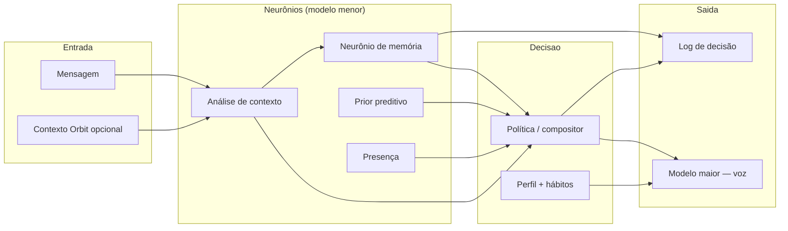

# Luna Core

> **A LLM grande é a voz. Os modelos menores são os neurônios. O Core orquestra.**

Pacote TypeScript da **PAIA** (*Persistent Artificial Identity Architecture*) — primeira implementação da identidade artificial persistente da Luna. O Core não substitui o chat: ele **decide** (política, memória, presença, perfil) e **delega a fala** ao modelo maior.

**Repositório:** [github.com/NowardEthan/luna-core](https://github.com/NowardEthan/luna-core)  
**Versão:** `0.2.0` · Node ≥ 20

---

## Visão geral

| Conceito | Descrição |
|----------|-----------|
| **Hipótese** | Política calculada (constituição + neurônios menores) > prompt monolítico |
| **Modelo menor** | Análise, memória, planejamento, avaliação |
| **Modelo maior** | Resposta final ao utilizador |
| **Persistência** | Sessões JSON, memória longa SQLite, perfil comportamental, presença |
| **Cliente principal** | [Orbit](https://github.com/NowardEthan/Luna) — shell desktop Electron + React |

---

## Estado das fases

| Fase | Entregável | Status |
|------|------------|--------|
| **V0** | Constituição, pipeline, política, validação empírica | ✅ |
| **V1** | Memória de sessão, neurônio de memória, memória longa (SQLite + embeddings) | ✅ |
| **V2** | Presença contextual, fila/daemon, transições chat ↔ Forge | ✅ |
| **V3.1** | Prior preditivo de intenção | ✅ |
| **V3.2** | Perfil comportamental e hábitos activos | ✅ |
| **V3.3–V3.8** | Agente IDE (`executarAgenteIde`, planejador, executor, avaliador) | 🔵 no código · integração Orbit em evolução |
| **V4+** | Plasticidade, corpo digital | ⬜ planejado |

**Testes:** `npm test` → **454+** cenários (32 ficheiros Vitest) · `npm run empirico` → bateria empírica V0/V1

---

## Arquitectura do pipeline



**Chat (`executarPipelineCompleto`):** análise → política → memória → presença → prior → perfil → resposta.

**Forge (`executarAgenteIde`):** planejador → executor agéntico (tool calling) → avaliador de tarefa — ferramentas injectadas pelo Orbit via `toolExecutor`.

---

## Início rápido

### Pré-requisitos

- Node.js 20+
- API compatível OpenAI (Groq, LM Studio, OpenRouter, etc.)
- `better-sqlite3` compila nativamente no teu Node (`npm rebuild` se mudares versão)

### Instalação

```bash
git clone https://github.com/NowardEthan/luna-core.git
cd luna-core
npm install
npm run build    # gera dist/ — obrigatório para o Orbit
npm test
```

### Configuração

Copia o exemplo e preenche as chaves:

```bash
cp .env.example .env
```

Perfis prontos (copiar para `.env` ou para ficheiros em `env.profiles/`):

| Ficheiro | Uso |
|----------|-----|
| `env.profiles/local.env.example` | LM Studio / Ollama local (`localhost:1234`) |
| `env.profiles/cloud-groq.env.example` | Groq cloud — **nunca** commits chaves reais |

Variáveis principais:

```env
LUNA_API_KEY=...
LUNA_API_BASE=https://api.groq.com/openai/v1
LUNA_MODELO_MENOR=llama-3.1-8b-instant
LUNA_MODELO_MAIOR=openai/gpt-oss-120b
LUNA_TEMPERATURA_MAIOR=0.85
LUNA_API_PAUSA_MS=2500
```

Modelo de voz Ollama (`luna-voz`): manifests em `src/personalidade/` — **pesos GGUF (~2 GB) não estão no Git**; importar localmente via Ollama.

---

## Comandos CLI

| Comando | Descrição |
|---------|-----------|
| `npm run chat -- "mensagem"` | Pipeline completo + resposta |
| `npm run chat -- --continuar "..."` | Continua a última sessão |
| `npm run chat -- --sessao UUID "..."` | Sessão específica |
| `npm run memoria -- "Eu sou autista"` | Neurônio de memória isolado |
| `npm run refletir -- --sessao UUID` | Reflexão pós-conversa → memória longa |
| `npm run presenca` | Estado de presença actual |
| `npm run estado` | Estado interno (tálamo) |
| `npm run policy -- "..."` | Só política (debug V0) |
| `npm run analisar -- "..."` | Só análise de contexto |
| `npm run empirico` | Validação empírica (regressões) |
| `npm run validar:v0` | Cenários V0 em JSON |
| `npm run validar:v1` | Cenários V1 |
| `npm run daemon` | Daemon de presença (fila) |
| `npm run build` | Compila TypeScript → `dist/` |
| `npm run check` | `tsc --noEmit` |
| `npm test` | Vitest |

**PowerShell:** usa sempre `--` antes dos argumentos do chat:

```powershell
npm run chat -- --continuar "Lembra do que eu disse?"
npm run chat -- --sessao 448d36dd-6f2a-40a0-a782-2a020662e7cd "Olá"
```

---

## Integração Orbit (desktop)

O [Orbit](https://github.com/NowardEthan/Luna) importa o Core no processo Electron:

```javascript
// electron/lunaCoreBridge.cjs
import(entry-desktop.js) → executarPipelineCompleto(msg, { ambiente: "desktop", sessaoId })
```

**Pré-requisito:** `npm run build` neste repositório.

**Exports principais** (`dist/entry-desktop.js`):

| Export | Uso |
|--------|-----|
| `executarPipelineCompleto` | Turno de chat |
| `executarAgenteIde` | Agente Luna Forge (IDE) |
| `prepararSessaoOrbit` | Liga `Conversation.id` ↔ sessão Core |
| `buscarContextoOutrasSessoes` | Recall entre conversas |
| `listarMemoriaLongaResumo` | Painel de memórias |
| `executarReflexaoSessao` | Reflexão ao apagar conversa |

Variável no Orbit: `LUNA_CORE_PATH` apontando para esta pasta.

---

## Estrutura do código

```
src/
├── pipeline/           executarPipelineCompleto, executarAgenteIde
├── analyzers/          contexto, léxicos, reflexão de sessão
├── decision/           compositor de política
├── memoria/            sessão JSON + longa SQLite + embeddings
├── presenca/           ambiente, transições, fila
├── preditivo/          prior de intenção (V3.1)
├── perfil/             hábitos comportamentais (V3.2)
├── personalidade/      bloco de voz / Modelfile Ollama
├── agente/             planejador, executor, avaliador (Forge)
├── integracao/         API Orbit (recall, reflexão, sessão)
├── providers/          OpenAI-compat (Groq, LM Studio, …)
├── responder/          modelo maior — voz da Luna
├── cli/                chat, memoria, daemon, empirico, …
└── entry-desktop.ts    entry point Electron

tests/                  32 suites Vitest
logs/                   sessões, validação, decisões (gitignored)
env.profiles/           exemplos de perfil (.env.example)
```

---

## Desenvolvimento

```bash
npm run build:watch   # compilação contínua
npm run check         # typecheck
npm test              # suite completa
npm run empirico      # regressão empírica
```

Relatórios V0: `logs/validacao-v0/` · cenários: `tests/cenarios-v0.json`, `tests/cenarios-v1.json`.

Documentação conceptual (teses, roadmap narrativo, continuidade para IA) vive no monorepo local `Core/Luna/Teses de Arquitetura/` — fora deste repo.

---

## Roadmap imediato

- Consolidar integração Orbit I5 (Forge híbrido + `executarAgenteIde`)
- V3.8 — simplificar bridge IPC e turno IDE no shell
- V4 — plasticidade e corpo digital (pós-Forge estável)

---

## Licença

Projeto privado · uso restrito ao ecossistema Lunar / Ethan Noward.
